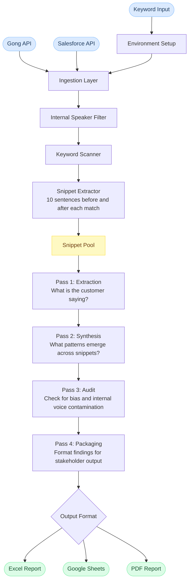

# Data Flow

This diagram shows how data moves through Project Crosstalk from source to final output.

---

## Stage Descriptions

**Environment Setup**
Installs required libraries, mounts Google Drive, and loads API credentials. This runs before any data is touched to ensure the system has everything it needs.

**Ingestion Layer**
Connects to the Gong API to pull call transcripts and metadata. Connects to the Salesforce API to pull firmographic and opportunity data. Both are combined into a unified record per customer interaction.

**Internal Speaker Filter**
Removes all turns from internal Trimble speakers. Only customer voice passes through to the next stage.

**Keyword Scanner**
Scans each transcript for predefined keywords, competitor names, product mentions, and thematic concepts. Flags each match with its location in the transcript.

**Snippet Extractor**
For each flagged match, extracts a context window of approximately 10 sentences before and after. These snippets are what the AI actually reads. Full transcripts are never passed to the model.

**Snippet Pool**
The collection of all extracted snippets for a given analysis run. Snippets can be grouped per call or aggregated per customer depending on the analysis type. This is the only input to the AI pipeline.

**AI Analysis Pipeline (4 passes)**
Each pass has a specific, scoped job. Outputs from one pass feed into the next. This structure reduces hallucination and improves consistency across large volumes of input.

**Output Layer**
Final packaged findings are delivered as an Excel file with formatted headers and hyperlinks back to the source calls, a Google Sheets file for interactive filtering, or a PDF depending on the use case and stakeholder.

---

[Back to Project Crosstalk](../README.md)
