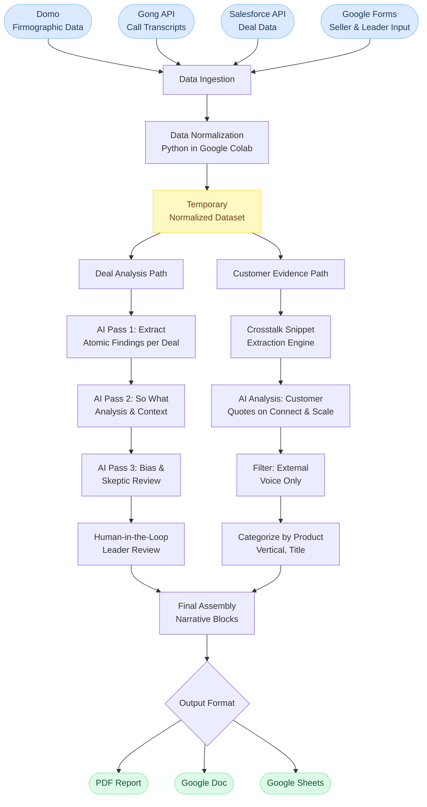

# Data Flow

This diagram shows how data moves through Project Higgs from raw sources to board-ready deliverables.

---

## Stage Descriptions

**Data Ingestion**
Pulls from four sources: Domo for firmographic and financial data, the Gong API for call transcripts, the Salesforce API for deal records and pipeline data, and Google Forms for qualitative input from sellers and leadership.

**Data Normalization**
All inputs are transformed and normalized in Python running in Google Colab. The result is a single temporary dataset that can be branched into different analysis paths.

**Deal Analysis Path**
Individual deals are run through a multi-pass AI pipeline. Pass 1 extracts atomic findings from each deal. Pass 2 generates "so what" context explaining why the deal matters. Pass 3 reviews for bias and skepticism to ensure the analysis is balanced. Leaders then review the output before it is finalized.

**Customer Evidence Path**
Uses the Crosstalk snippet extraction engine to scan across the full transcript database for customer mentions of customer adoption initiatives. Internal speakers are filtered out. Results are categorized by product, customer vertical, and speaker title.

**Final Assembly**
Both paths feed into a final assembly step where AI drafts narrative blocks for each section of the board material. These blocks are combined into the final deliverable in the requested format.

---

[Back to Project Higgs](../README.md)
