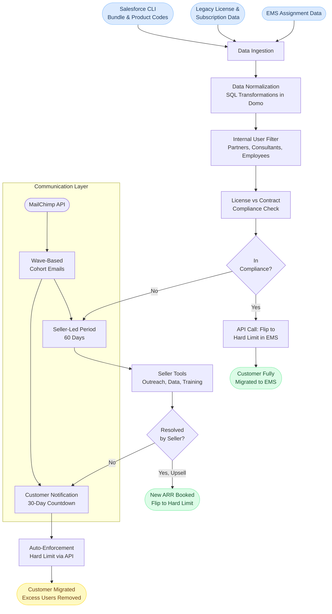

# Data Flow

This diagram shows how a customer moves through the EMS Transition system from initial data ingestion to full migration.

---

## Stage Descriptions

**Data Ingestion**
Pulls three data streams: new EMS assignment data showing how many licenses each customer is consuming, legacy license and subscription data from the existing Viewpoint system, and bundle and product code data from the Salesforce CLI. All three must be merged to create a complete picture.

**Data Normalization**
Runs through extensive SQL transformations in Domo to merge EMS data with legacy data and break it out by individual product. This is necessary because the two data sources use different structures and identifiers.

**Internal User Filter**
Filters out Trimble employees, partners, and consultants before compliance is checked. This filter was built as a stopgap because EMS did not originally account for internal users logging into customer systems.

**Compliance Check**
Compares assigned users against contracted licenses per product per customer. Determines whether each account is already in compliance or needs seller intervention.

**Seller-Led Period (60 Days)**
Non-compliant customers enter a 60-day window where sellers are equipped with tools and data to reach out, explain the situation, and convert the overage into an upsell. Sellers have bulk outreach tools, license audit views, and training to support this.

**Customer Notification (30-Day Countdown)**
If a seller has not resolved the overage after 60 days, the customer receives direct communication that a hard license cap will be enforced in 30 days.

**Auto-Enforcement**
After 90 total days, the system calls the EMS API to flip the customer from a soft limit to a hard limit. Excess users are removed from the system. Admin access is preserved.

**Communication Layer**
MailChimp receives cohort lists via the Salesforce API. Customers are routed into the correct email sequence based on their migration stage. Emails are sent in waves, not all at once.

---

[Back to EMS Transition](../README.md)
