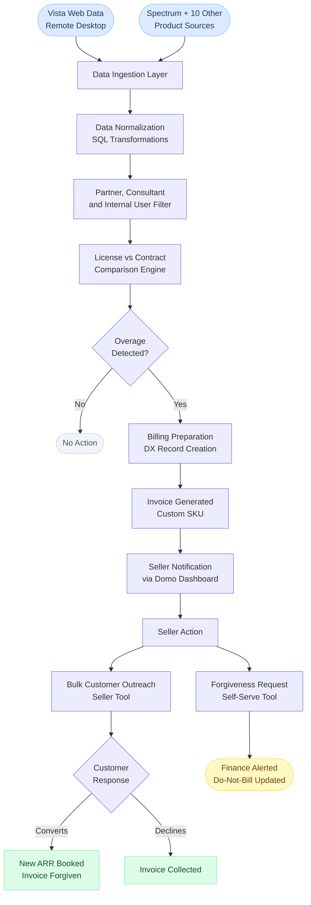

# Data Flow

This diagram shows how data moves through the On-Demand Program from raw product sources to seller action and revenue outcome.

---

## Stage Descriptions

**Data Ingestion Layer**
Pulls license count and subscription data from 11 different product sources. Vista Web data requires logging into a remote desktop connection. Other product sources expose data through SQL feeds. All sources run on a monthly cadence.

**Data Normalization**
Runs hundreds of SQL transformations to convert 11 different data formats into a single unified structure. This stage also handles the Salesforce instance remapping, where thousands of customers previously hidden in the old Viewpoint instance were exposed by remapping from the legacy Salesforce instance to the new DX instance.

**Partner, Consultant, and Internal User Filter**
Dynamically filters out internal Trimble users, consultants, and partners before the license comparison runs. This filter runs automatically and is updated as the customer base changes. It was not available in the original program.

**License vs Contract Comparison Engine**
Compares assigned user counts against contracted license counts for every customer across all 11 products. Flags any account where assigned users exceed the contracted amount.

**Billing Preparation**
Creates DX records and order products using a custom SKU designed specifically for on-demand invoicing. This required designing a new billing structure that did not previously exist in the system.

**Seller Notification**
Flagged accounts surface in the Domo dashboard where sellers and stakeholders can view licensing status, overage amounts, and historical billing data for their accounts.

**Seller Tools**
Sellers can initiate bulk email outreach to customers directly from the tool without manual work. They can also submit forgiveness requests and update billing status flags for their accounts without submitting a ticket.

**Revenue Outcome**
When a seller converts an overage conversation into a contract expansion, the new ARR is booked and the on-demand invoice is forgiven. If no conversion happens, the invoice is collected as-is.

---

[Back to On-Demand Program](../README.md)
