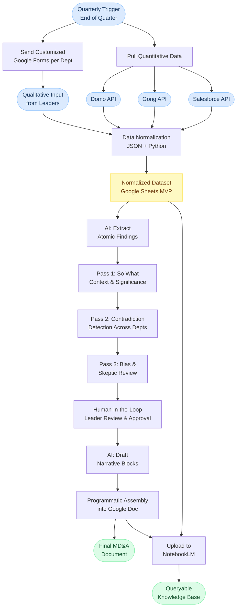

# Data Flow

This diagram shows how data moves through the Programmatic MD&A Workflow from quarterly trigger to final deliverable.

---

## Stage Descriptions

**Quarterly Trigger**
The workflow fires automatically at the end of each quarter. It simultaneously sends customized Google Forms to each department and begins pulling quantitative data from APIs.

**Google Forms Collection**
Each department receives a form tailored to the information they need to provide. This replaces the unstructured process where leaders submitted narratives in whatever format and timeline they chose.

**Quantitative Data Pull**
Connects to Domo for financial and firmographic data, Gong for call transcript signals, and Salesforce for deal and pipeline data. All pulls happen in parallel.

**Data Normalization**
Qualitative responses and quantitative data are merged and transformed using JSON and Python into a single normalized dataset. The MVP stores this in Google Sheets. A future version would use Postgres.

**Atomic Findings Extraction**
AI breaks the normalized dataset into discrete, testable findings. Each finding is a single statement that can be individually analyzed rather than part of a large, tangled narrative.

**Three-Pass Analysis**
Pass 1 adds "so what" context to each finding. Pass 2 checks for contradictions across departments, catching cases where one team's narrative conflicts with another's data. Pass 3 reviews for bias and applies skepticism to counteract LLM positive framing.

**Human Review**
Leaders are notified and review the analyzed findings. They approve, edit, or reject each one. This is the primary quality gate before the document is assembled.

**Document Assembly**
AI drafts narrative blocks from the reviewed findings. The blocks are programmatically assembled into a Google Doc using the standard MD&A structure.

**NotebookLM Upload**
The final document and all raw inputs are uploaded to NotebookLM. Leadership can then query the underlying data conversationally at any time without requesting a follow-up report.

---

[Back to MD&A Workflow](../README.md)
