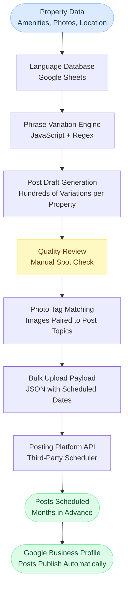

# Data Flow

This diagram shows how property data moved through the system from raw input to scheduled Google Business Profile posts.

---

## Stage Descriptions

**Property Data Entry**
Each apartment complex client was set up in the language database spreadsheet with their specific information: amenity list, location details, community highlights, photo library tags, and any client-specific language preferences.

**Phrase Variation Engine**
JavaScript and regex formulas combined the property data with the variation library to generate hundreds of distinct post drafts per property. Each draft used different phrasing, different amenity combinations, and different structural patterns to avoid repetition.

**Quality Review**
A brief manual spot check was run on each property's generated posts before scheduling. This was the 30-minute monthly task that replaced 16 hours of manual writing. The review caught any posts that sounded unnatural or paired incorrectly with their photos.

**Photo Tag Matching**
Each post was tagged with a topic category. The system matched posts to photos from the property's image library based on those tags. A post about the pool was paired with a pool photo. A post about the gym was paired with a gym photo.

**API Upload and Scheduling**
The final payload was uploaded to the posting platform API in bulk, with each post assigned a specific publication date and time spread across the coming months. Once uploaded, no further action was required until the next monthly cycle.

---

[Back to GBP Automation](../README.md)
